# Install Kali Linux on Oracle VirtualBox

If you ask any cybersecurity practitioner what tool they used the most to develop their security skills when they started, most of them would recommend Kali Linux.

Hello, guys.

Today we will be starting our journey into the cybersecurity industry by installing **Kali Linux** onto **Oracle VirtualBox**, a virtual machine.

Before we get into the details, what are Kali Linux and Oracle VirtualBox?

## INTRODUCTION
* Kali Linux is a powerful Debian-based Linux distribution designed for penetration testing and digital forensics.
* It is primarily intended for security specialists, but it can also be used by beginners interested in learning about cybersecurity.
* While it is possible to install Kali Linux directly on hardware or use it as a live system, many people prefer to run it in a virtual machine like VirtualBox.

<a>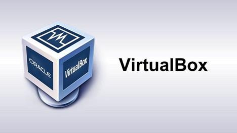</a>

* Oracle VirtualBox is a free, open-source, cross-platform virtualization software that allows uses to run multiple operating systems simultaneously on a single machine.

Running Kali Linux in a virtual machine provides a sandboxed environment, protecting your host system from potential security risks. It also allows you to take snapshots, making it easier for you to revert changes.

## PREPARATION
Before we begin our installation, we must ensure our system meets basic requirements:
* At least 4GB of RAM (8GB recommended).
* Minimum 20GB of hard disk space (50GB recommended).

Additionally, VirtualBox requires your host Operating System (OS) to be at least:
* Windows 10 or later.
* macOS 13 or later.

Now let us start with the installation.

## INSTALLATION
### VirtualBox Installation
* Navigate to <a href="https://www.virtualbox.org/">Oracle VirtualBox.</a>
* Click on Downloads and choose the operating system you would like to use (Windows, macOS, Linux distributions etc.)
* Once the file is downloaded, run it to start the Setup application.

<a>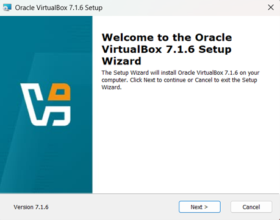</a>

* Follow the instructions to complete the installation and you should be able to run the VirtualBox application.

<a>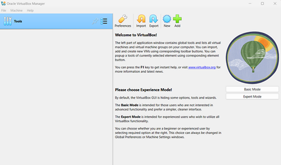</a>

### Download Kali Linux ISO Image
ISO Images are a digital copy of an optical disc, saved as a single file. They are excellent vessels for operating systems, since they are a single file that contains large amounts of data.

* Navigate to <a href="https://www.kali.org/get-kali/#kali-installer-images">Kali Linux Installer Images.</a>
* Choose the x86_64 ISO Image and download it.

<a>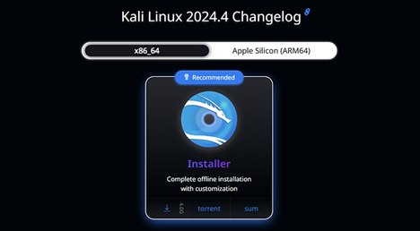</a>

* Before we run Kali Linux, we need to configure the Virtual Machine.

### Configure Virtual Machine
* In the VirtualBox Manager, choose the New option to create a new Virtual Machine and enter the following details:
  1. **Name**: KaliLinux2025
  2. **Folder**: Specify the folder you want to store the instance.
  3. **Type**: Linux
  4. **Subtype**: Debian
  5. **Version**: Debian (64-bit)

<a>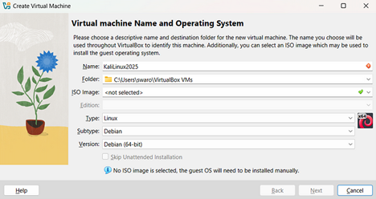</a>

* Next, choose your memory and processor requirements, but make sure you slider stays in the green zone.

<a>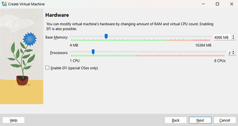</a>

* Depending on your host system, choose your disk space with a minimum of 20GB allotted.

<a>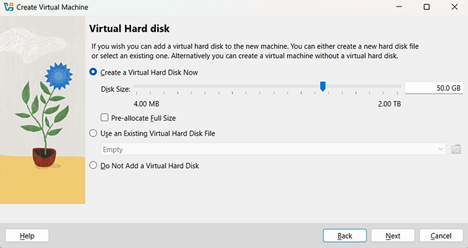</a>

* Verify your settings and click on **Finish**.

<a>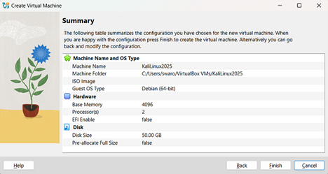</a>

* We have thus created a Virtual Machine. Now, click on **Settings**.

<a>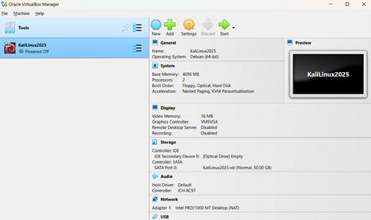</a>

* In the Advanced tab of the General section change the **“Shared Clipboard”** to Bidirectional option. This allows us to share clipboards between host machine and Kali Linux.

<a>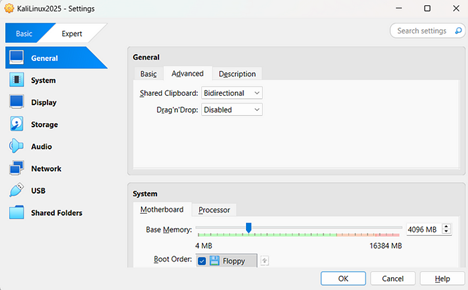</a>

* In the Display section, set **Video Memory** to maximum and enable **3D Acceleration**. This allows Kali Linux to use host machine’s GPU.

<a>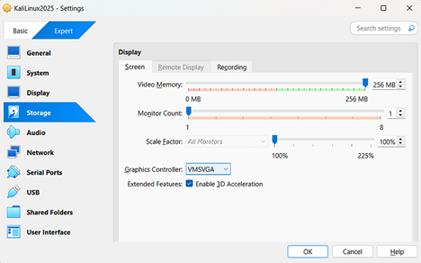</a>

* In the Storage section, under **Controller: IDE**, select the **Empty** option, click on the disk logo and select **Choose a Disk File**.

<a>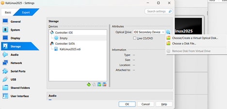</a>

* Choose the Kali Linux ISO Image we downloaded in the beginning and add it.
* Next, in the Network section, select the network to be **Bridged Adapter**. This allows Kali Linux to have an IP address and can be remotely connected via SSH.

<a>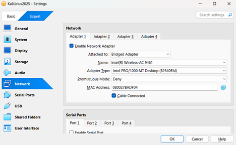</a>

* Click on **OK** and we have finished configuring the Virtual Machine.

### Install Kali Linux
* Click **Start** on the Kali Linux Instance.

<a>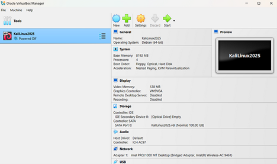</a>

* Select **Graphical Install** as the mode of installation.

<a>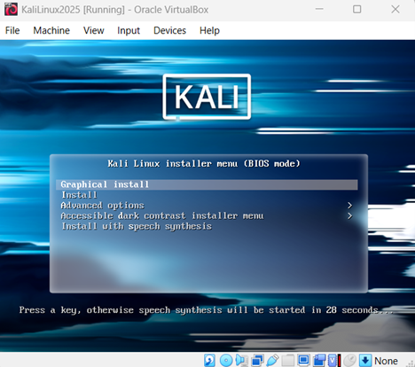</a>

* Follow the onscreen instructions and select **kali** as the hostname.

<a>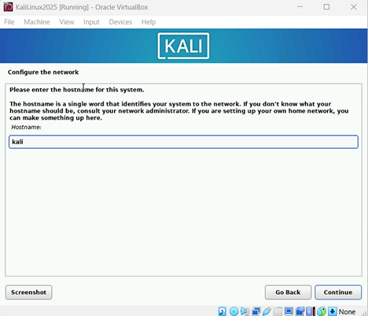</a>

* Set up your username and password and also choose your local clock settings.
* Follow the default instructions for disk partitioning and choose **Yes** when asked to make changes.
* When prompted for the environment selection, you can leave it at the default **Xfce** environment or choose **GNOME** which has a better GUI.

<a>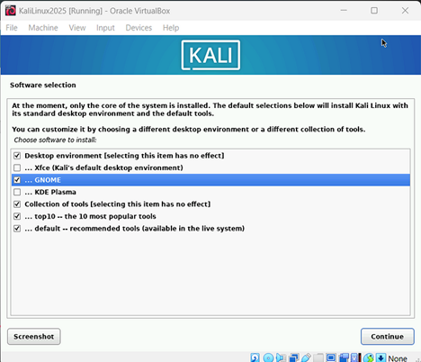</a>

* Select **Continue**, which will start the installation process. It typically takes around 15–20 minutes.
* When prompted, select **Yes** to install GRUB Loader and choose the option presented.

<a>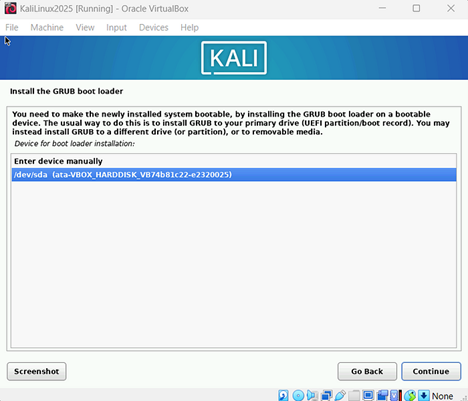</a>

* This finishes the Kali Linux installation and once you login with your credentials, you are presented with the Kali Linux Desktop.

<a>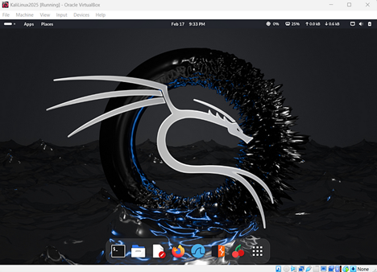</a>

Now, we are ready to dive into the world of cybersecurity with one of the most beginner-friendly tools.

  

