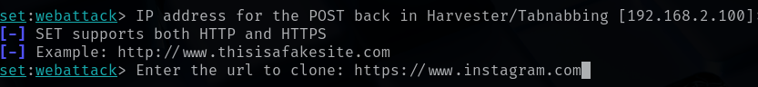

# Credential Harvesting Using Site Cloning

In this lab, we will be harvesting credentials using a cloned site with the help of **Social Engineering Toolkit**.

Credential harvesting is the process of gathering sensitive information on a target such as credit card details or passwords, without them knowing that this information is being captured.

For this lab, we only require Kali Linux running on a virtual machine.

Check out this post on how to install Kali Linux: <a href="https://github.com/sai-kantamuneni/Kali-Linux-Tools/tree/main/1.%20Install%20Kali">Install Kali Linux</a>

You can also access this lab here: <a href="https://www.101labs.net/comptia-security/lab-1-credential-harvesting-using-site-cloning/">101Labs</a>

## Social Engineering Toolkit

The Social Engineering Toolkit (SET) is an open-source penetration testing framework designed for social engineering attacks.

SET is widely used by security professionals, penetration testers, and researchers to simulate and test human vulnerabilities in cybersecurity environments.

It consists of various attacks but we will be using the **Site Cloner** option under **Credential Harvester Attack Method** in today’s lab.

Methodology:
* SET clones the specified website and hosts it on the attacker’s machine.
* The cloned site looks identical to the original but captures entered credentials.
* When victims visit the cloned site and enter their login information, the credentials are sent to the attacker’s machine.

## Steps
1. The first step is to boot your virtual machine and get Kali Linux up and running.
2. Once this is complete, open a terminal and start the Social Engineering Toolkit by typing:
`sudo setoolkit`
3. This starts the Social Engineering Toolkit

4. From the menu, choose option 1 for **Social-Engineering Attacks**. From the next menu choose option 2 for **Website Attack Vectors**.

5. You will be presented another menu with various attacks. Choose option 3 for **Credential Harvester Attack Method**.

6. You will be presented with yet another menu asking you to choose a method to harvest credentials. Choose option 2 **Site Cloner**.

7. SET will ask you for your IP address so that it can send the POST requests from the cloned website back to your machine.

8. For this lab, enter your Kali machine’s local IP address. This can be found by opening a new terminal and typing _ifconfig_.

9. Once you tell SET that you would like to clone a website, it will then ask you for the URL of the site you wish to clone. You can enter any site you like, but for this lab I will be using https://www.instagram.com.

10. Once the URL is entered, SET will clone the site and display all the POST requests of the site back to this terminal. It is now time to navigate to the cloned site.

11. To get to the cloned site, open Firefox in your Kali machine and enter your **local IP address** into the browser. You will then be able to view the cloned login page for Instagram.

12. Enter a random username and password into the fields and press Log In.

13. Finally, go back to the terminal where SET is running. You will see lots of text from the numerous POST requests being sent from the cloned site.

14. Scroll down until you see the values username and password.

15. You should be able to see the username and password you entered in the cloned site in cleartext.

16. We can see the entered password: **Password123** in line 2 and email: **sai@gmail.com** in line 8.

17. Thus, we have harvested the credentials.
