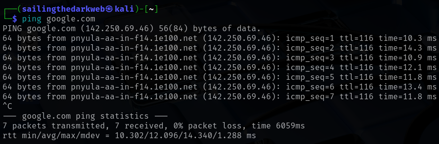
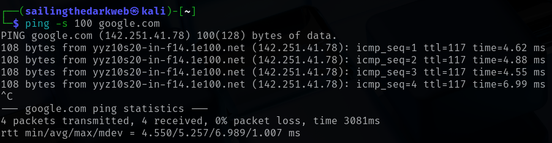
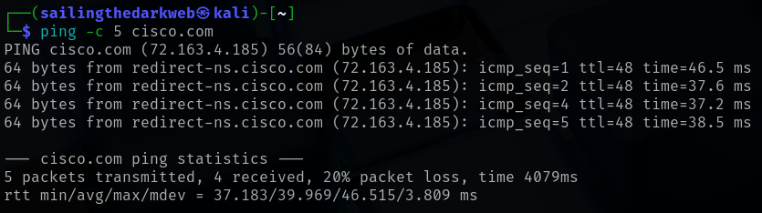
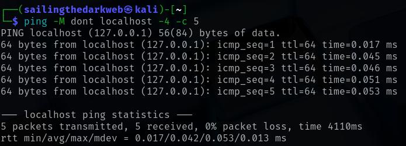
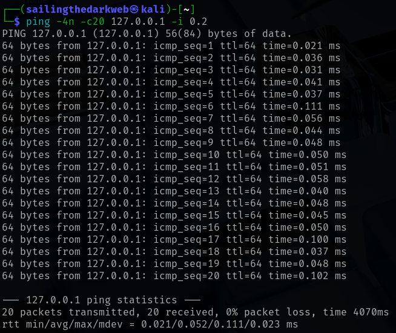

# Ping

In this lab, we will be attempting to understand ping and its different uses.

For this lab, we only require Kali Linux running on a virtual machine.

Check out this post on how to install Kali Linux: <a href="https://github.com/sai-kantamuneni/Kali-Linux-Tools/tree/main/1.%20Install%20Kali">Install Kali Linux</a>

You can also access this lab here: <a href="https://www.101labs.net/comptia-security/lab-12-ping-and-its-various-uses/">101Labs</a>

## Ping
* Ping is a fundamental computer network utility used to test the reachability of a host on an Internet Protocol (IP) network.
* It works by sending small data packets, known as Internet Control Message Protocol (ICMP) Echo Requests, from the source device to a target host.
* If the target host is accessible, it responds with an ICMP Echo Reply packet.
* This process allows users to verify if a device is connected to the network and measure the round-trip time (RTT), which indicates network latency and performance.

## Ping Options
* Let us begin with pinging **google.com**
`ping google.com`

* The ping command will continue to send ICMP packets to the destinated IP address until it receives an interruption.
* To stop the command, just hit the Ctrl + C key combination.
* Let us try to understand the ping results:-
  1. The IP address in the first line is the address of the hostname we are pinging.
  2. The reverse DNS name of the target IP address (pnyula-aa-in-f14.1e100.net).
  3. The number of data bytes. The default is 56, which translates into 64 ICMP data bytes.
  4. The ICMP sequence numbers for each packet.
  5. TTL: The Time to Live values
  6. The ping time, measured in milliseconds, which is the round trip time for the packet to reach the host and the response to return to the sender.

* We can set the size of the packet by typing:
`ping -s 100 google.com`

* We can also set the number of packets we can send by typing:
`ping -c 5 cisco.com`

* To use only the IPv4 version of the machine's setting, type:
`ping -M dont localhost -4 -c 5`

* We can also set the wait time for each packet,
`ping -4n -c20 127.0.0.1 -i 0.2`

* This sends 20 packets within 0.2 ms interval

