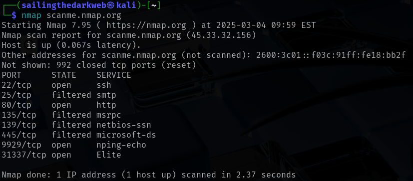
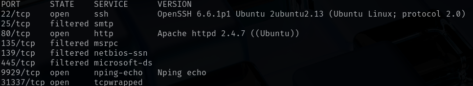
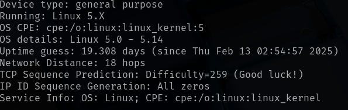
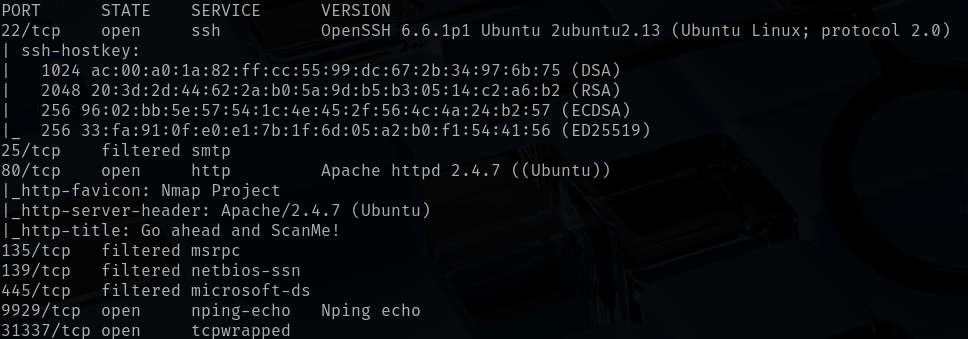
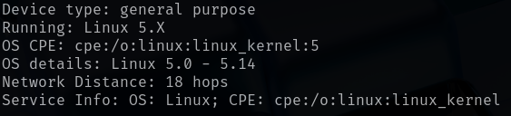
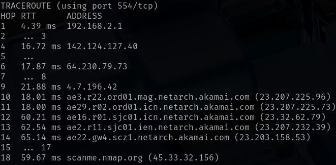

# NMAP
In this lab, we will be scanning a website using the Nmap tool.

For this lab, we only require Kali Linux running on a virtual machine.

Check out this post on how to install Kali Linux: <a href="https://github.com/sai-kantamuneni/Kali-Linux-Tools/tree/main/1.%20Install%20Kali">Install Kali Linux</a>

You can also access this lab here: <a href="https://www.101labs.net/comptia-security/lab-2-nmap/">101Labs</a>

## Nmap
**Nmap (Network Mapper)** is one of the most common tools used among hackers and system administrators. It is used to scan a host, which can be a server, computer or a network.

When running an Nmap scan, the goal is discover various types of information such as:
* Devices that are connected to a network
* Ports that are open on a device
* Services that are running on these ports

In today's lab we will be scanning the following site: <a href="http://scanme.nmap.org/">Nmap.org</a>

This website has been developed by Nmap for the purpose of scanning.

**NOTE: Never scan any site, system, or network without prior permission from the owner.**

## Task 1
* Nmap comes pre-installed in Kali Linux.
* Just open a terminal and type
`nmap scanme.nmap.org`
* This will initiate a scan of the target and will attempt to determine which ports are open and what services are open on these ports:

* As you can see from the result, there are 4 ports open, and there are different services running on each port.
* The scan we performed is a very basic scan and will only scan the top 1000 ports for basic information.

## Task 2
* Let us now perform an advanced scan.
* In this scan we will determine,
  1. The versions of services running on each port.
  2. The operating system of the webserver running the target site.
* Enter the following command into the terminal
`nmap -v -sT -sV -O scanme.nmap.org`
* Let us try to understand what is happening here:
  1. **"-v"** - Stands for verbose which provides detailed information during the scan.
  2. **"-sT"** - Performs a TCP connect scan, by establishing a full connection with each target port.
  3. **"-sV"** - Enables version scanning, which determines service and version information of ports.
  4. **"-O"** - OS Detection, identifying the operating system of the target.
* If the command asks for root privileges, type the following command:
`sudo nmap -v -sT -sV -O scanme.nmap.org`

* As you can see here, all of the open ports display the exact versions of software running.

* In this section, you can see the OS of the target and uptime guess shows us last known verified time of the OS.

## Another Method for Task 2
* Another command to figure out the versions and the OS is
`nmap -A scanme.nmap.org`
* This command stands for **All** which combines the **"-sV"** and **"-O"** flags.
* Additionally it also gives us the traceroute to this website.

## Extra scans
Visit the following website to see the different scans you can run against targets: <a href="https://nmap.org/book/port-scanning-options.html">Different Nmap scans</a>
