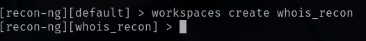

# RECON-NG
In this lab, we will be gathering personal information about a website using the **Recon-ng** tool.

For this lab, we only require Kali Linux running on a virtual machine.

Check out this post on how to install Kali Linux: <a href="https://github.com/sai-kantamuneni/Kali-Linux-Tools/tree/main/1.%20Install%20Kali">Install Kali Linux</a>

You can also access this lab here: <a href="https://www.101labs.net/comptia-security/lab-3-recon-ng/">101Labs</a>

## WHOIS
WHOIS is a public database that stores information about domain name registrations and DNS settings updates.

It acts as "phonebook" for the internet, providing details about who owns a domain and how to contact them.

The primary purpose of WHOIS is to promote transparency and accountability in domain ownership.

WHOIS typically contains the following information:
* Owner Details: Name, mailing address, phone number, city, postal code and country.
* Registration Details: Registration dates and expiration dates.

In this lab, we will automate this discovery using the recon-ng tool.

## Recon-ng
Recon-ng is an open-source reconnaissance framework used for information gathering and OSINT (Open Source Intelligence) collection in the field of cybersecurity.

It is a powerful tool designed to automate the process of gathering intelligence about target systems or networks.

Features of Recon-ng:
* Automation: Recon-ng automates many reconnaissance tasks, saving time and effort for security professionals.
* Data Collection: It gathers information from various sources, including public databases and search engines.

## Task 1 - Setting up Workspace
* Recon-ng comes pre-installed in Kali Linux.
* Just open a terminal and type:
`recon-ng`

* Recon-ng allows us to create different workstations based on their project needs.
* For this lab, since we will be gathering WHOIS information, let us create a new workspace:
`workspaces create whois_recon`

## Task 2 - Installing Modules
* Before we begin searching for WHOIS information, we need to install the WHOIS search module.
* To do this type:
`marketplace whois search`

* We want to install the 4th option, which is **"recon/domains-contacts/whois_pocs"**.
* **"whois_pocs"** is a module which is used to harvest **Point of Contact (POC)** data from WHOIS queries for the given domain.
* It will attempt to retrieve contact information such as names, email addresses, and phone numbers associated with the domain registration.
* Use this command to install the module:
`marketplace install recon/domains-contacts/whois_pocs`

## Task 3 - Searching
* Since WHOIS information is available to anyone, it is ok to do this for any domain.
* The domain we will be targeting is **"facebook.com"**.
* Before we start searching, we need to load the module by typing:
`modules load recon/domains-contacts/whois_pocs`
* Then we need to set the source of the target by typing:
`options set SOURCE facebook.com`
* Now, to see information about the module and how to use it, type
`info`

* Now that we are ready to run the search for WHOIS, we simply type:
`run`

* As you can see, various contact and location information will show up.

## Task 4 - Searching for Subdomains
* We will now attempt to discover as many subdomains as possible for facebook.com
* For this we will be using the <a href="https://hackertarget.com/">HackerTarget</a> API. 
* This API is available as module in recon-ng named as **hackertarget**.
* **hackertarget** is a module in Recon-ng used for gathering information about domains and hosts. It's specifically designed to find subdomains associated with a target domain.
* First we need to quit out of the **whois_pocs** module by typing:
`back`
* Then we search for the **hackertarget** module using this command:
`marketplace search hackertarget`
* We install the **hackertarget** module using this command:
`marketplace install recon/domains-hosts/hackertarget`

* Then we following the same process that we used for **whois_pocs** to load the **hackertarget** module by typing:
`modules load recon/domains-hosts/hackertarget`
* Set the target by typing:
`options set SOURCE facebook.com`
* To see the general info for this module, type:
`info`

* Once this is done, type:
`run`
* You will notice a list of various subdomains associated with facebook.com appearing.

If you scroll to the end of the list, you can see that we found **501 total subdomains** for Facebook.

This information can be useful for an attacker who may be targeting Facebook.

They can use this information to attack the various subdomains and their IP addresses associated with Facebook, as they may not all be equally secure, to find a way through their security.
