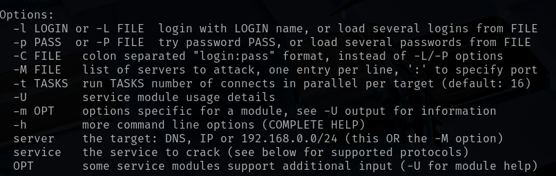
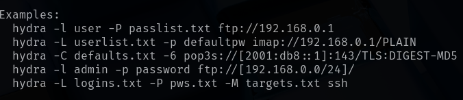
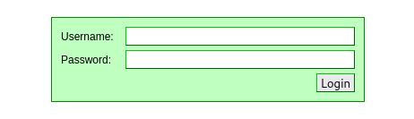
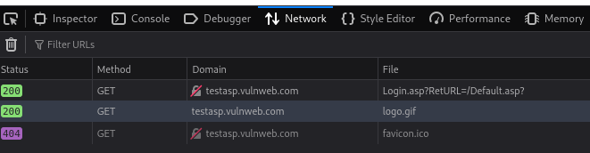
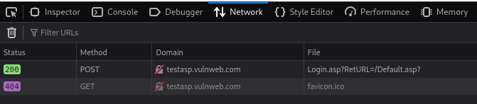
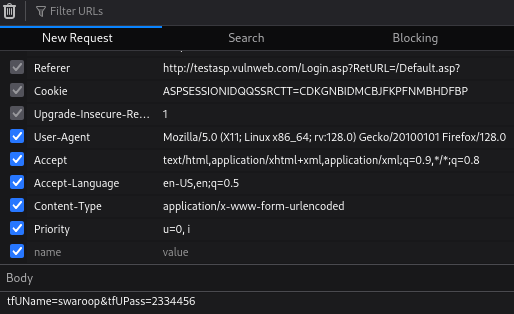
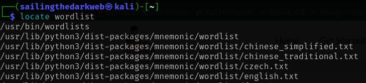
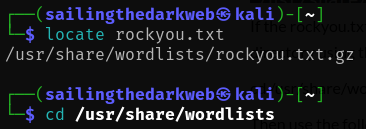
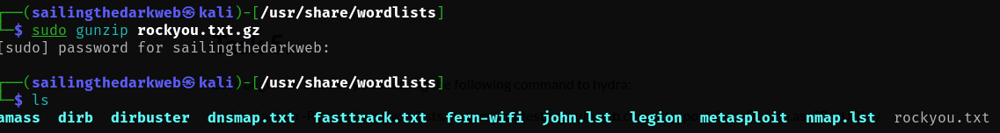
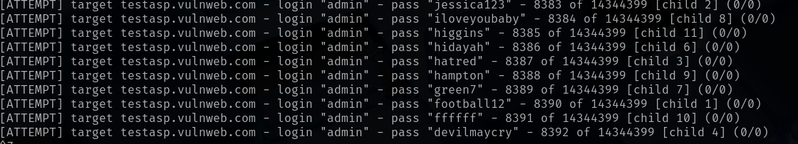

# Dictionary Attack Using Hydra
In this lab, we will be conducting a dictionary attack to crack passwords online using **Hydra**.

For this lab, we only require Kali Linux running on a virtual machine.

Check out this post on how to install Kali Linux: <a href="https://github.com/sai-kantamuneni/Kali-Linux-Tools/tree/main/1.%20Install%20Kali">Install Kali Linux</a>

You can also access this lab here: <a href="https://www.101labs.net/comptia-security/lab-4-hydra/">101Labs</a>

## Dictionary Attack
Dictionary attack is a type of attack where attackers try to gain access to password-protected systems by taking a combination of words from a wordlist and attempts them along with a username to login as a user.

The process usually involves:
* Creating a list of potential passwords from dictionaries, leaked passwords, and common phrases.
* Using specialized software to generate variations of these words, such as substituting numbers for similar-looking letters or appending digits.
* Systematically inputting these generated passwords into the targeted system.

This process typically takes a long time to perform, and the results are dependent on the accuracy and quality of your wordlist.

A dictionary attack is a form of brute forcing.

## Hydra
One of the specialized software used to carry out dictionary attacks is known as Hydra.

Hydra is a powerful, versatile password cracking tool used for penetration testing.

Features:
* Hydra can launch multiple attacks simultaneously using threads.
* It can target a wide range of protocols including SSH, FTP, HTTP(S) etc.
* It can take customized wordlists to increase the probability of successful password cracking.

## Task 1 - Hydra
1. For this lab, we will be using the command line version of Hydra.
2. Type the following command to understand how Hydra works:
`hydra`

3. To get a more detailed guide and example commands, type:
`hydra -h`

## Task 2 - Investigation
1. The website that we will be targeting is the following: <a href="http://testasp.vulnweb.com/Login.asp?RetURL=/Default.asp?">Test Website</a>
2. **NOTE: This site has been developed for the purpose of hacking, and you should not use Hydra on any other site without permission from the owner.**

3. To use Hydra on an online target, we need to capture the post-form parameters.
4. Hydra will use these parameters to send various requests to the correct target.
5. To capture information, open the link in a browser and press **Ctrl + Shift +I**, to open the browser developer tools panel.
6. Navigate to the tab called "**Network**". Once you are there, reload the page by either pressing the Reload button or by pressing **Ctrl + F5**.
7. This shows us several **GET** requests, which is the result of our system requesting data from server to view the login page.

8. Now, enter a random username and password into the login page and click login.
9. You should see a new **POST** request pop up in the Network tab. This is our system sending data to the server.

10. This request contains the parameters we need.
11. Right click on the POST request and select "**Edit and Resend**". A page will open with information pertaining to the POST request.
12. Scroll down to the Request Body section and copy the **tfUName** and **tfUPass** parameters.

13. **tfUName** - The username we enter is stored in this variable.
14. **tfUPass** - The password we enter is stored in this variable.

## Task 3 - Wordlist
1. We also need a wordlist from which Hydra tests the passwords to login as this account.
2. Luckily for us, Kali Linux has an inbuilt directory which is full of wordlists to choose from.
3. To locate them, type:
`locate wordlists`

4. As you can see, there are lots of lists. We will be using the **rockyou.txt** wordlist for this attack.
5. Type the following command to see the path to this wordlist:
`locate rockyou.txt`

6. Navigate to this directory by typing:
`cd /usr/share/wordlists`

7. As you can see, the wordlist is in ".gz" format. This means that the file needs to be extracted.
8. Type the following command to extract the file:
`gunzip rockyou.txt.gz`

9. Great! Now we have all the information we need to begin the attack.

## Task 4 - Attack
1. We will be attempting to login into this website as **admin**.
2. Type the following command to begin the attack:
`hydra -l admin -P /usr/share/wordlists/rockyou.txt -vV -f testasp.vulnweb.com http-post-form "/Login.asp?RetURL=/Default.asp?:tfUName=^USER^&tfUPass=^PASS^:S=logout"`
3. Once you press enter the attack will begin and Hydra will start guessing passwords for the username **admin**.

4. While the attack is happening in the background let us try to break down the command:
   * "**-l**" is the username we will logging as. _(Since we know the username, we are using lowercase "**l**". If we do not know the username, we would use "**L**" instead along with a list of usernames)_
   * "**-P**" is the wordlist we will be using to guess the password for this user. _(If we know the password we will use "**p**" along with the password)_
   * "**-vV**" will show us each of the username and password for the login attempts.
   * "**-f**" will finish the attack when the correct username and password combination is entered.
   * **http-post-form** is the type of request Hydra will be sending to the server in order for us to login.
   * `"/Login.asp?RetURL=/Default.asp?:tfUName=^USER^&tfUPass=^PASS^:S=logout"`
   * This is the actual request Hydra is sending to the server.
   * Note that we added the **tfUName** and **tfUPass** parameters and this request USER and PASS with the -l and -P values we specified earlier.
5. Note that Hydra will probably not be able to guess the password, so you can end the attack at any point by pressing **Ctrl + C**.
