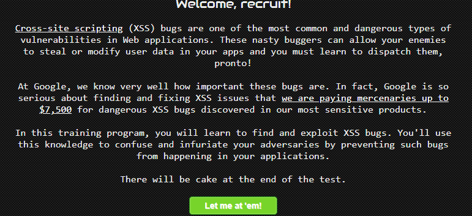
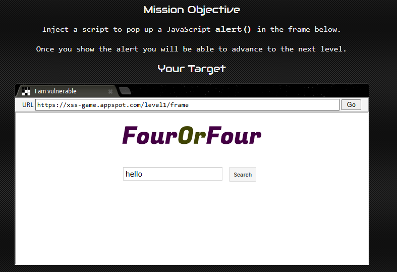
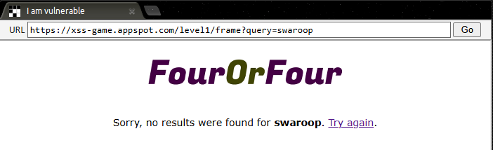
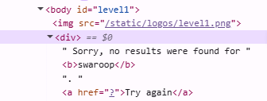
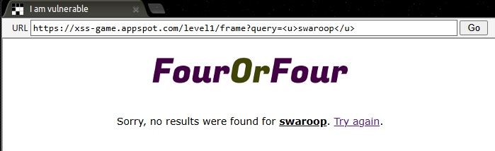
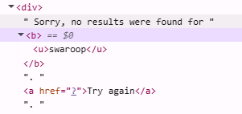
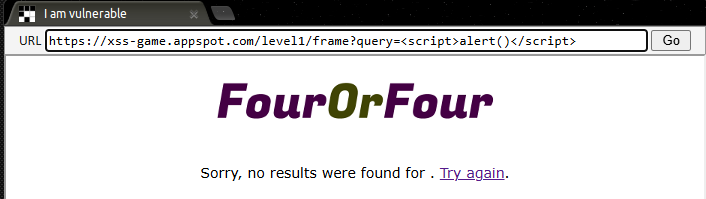
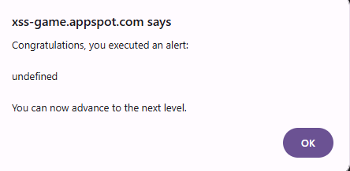

# Cross-Site Scripting (XSS) Attack

In this lab, we will be practicing on how to perform an XSS attack on a website.

For this lab, we only require access to a web browser.

You can also access this lab here: <a href="https://www.101labs.net/comptia-security/lab-5-conducting-a-cross-site-scripting-xxs-attack">101Labs</a>

## Cross-Site Scripting
* Cross - Site Scripting is a type of web security vulnerability that allows attackers to inject malicious client-side scripts into legitimate websites.
* Once the script is injected, when as unsuspecting user visits the compromised site, the browsers execute the malicious script.
* The executed script can then access sensitive information such as cookies, session tokens, or other data retained by the browser for that site.

## Website
* There are numerous websites that have been setup for the purpose of practicing attacks like XSS.
* Today, we will be using this website: XSS-Game

* This site has 6 levels of XSS which vary in difficulty.
* It also offers you several hints on how to proceed if stuck on a level.
* In this post, I will be solving Level 1 of the challenge.

## Level 1
* The objective of Level 1 is to inject a JavaScript to trigger an **alert**.

* Let us enter a random text into the search bar. I'm entering my name - **swaroop**.

* As you can see, our input is directly reflected in the output of the search result. That means that the application is most likely vulnerable to XSS.
* Right click on the webpage and click on **Inspect** to look at the source code of the page.

* Since the input is being reflected back, let us try to inject a script into the html link.
* Let us enter <u>swaroop</u>, which should underline our text.

* As you can see, our input also takes scripts. Let us take a look at the source code

* Even in the source code, the script is being executed as it is.
* So, now our task is to trigger an **alert**.
* In JavaScript, to trigger an alert, we can use the **alert()** function.
* Add the script - **** into the link after the query field.

* This triggers an alert and gives us the clear to go to the next level.

