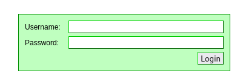

# Intercept Client-Side Requests

In this lab, we will be attempting to intercept client-side requests using **Burp Suite**.

For this lab, we only require Kali Linux running on a virtual machine.

Check out this post on how to install Kali Linux: <a href="https://github.com/sai-kantamuneni/Kali-Linux-Tools/tree/main/1.%20Install%20Kali">Install Kali Linux</a>

You can also access this lab here: <a href="https://www.101labs.net/comptia-security/lab-7-how-to-use-burp-suite-to-intercept-client-side-requests/">101Labs</a>

## Burp Suite
* Burp Suite is a comprehensive software platform for web application security testing and penetration testing.
* It has various features. Some of them include:-
  1. Proxy - Acts as an intermediary between the user's browser and web applications, allowing interception and modification of HTTP/HTTPS requests and responses.
  2. Scanner - Automatically detects various vulnerabilities such as SQL injection, cross-site scripting (XSS), and cross-site request forgery (CSRF).
  3. Repeater - Allows manual manipulation and resending of captured HTTP requests.

## Task 1 - Setting up Burp Suite and Firefox
* Open the Burp Suite application and choose all the default settings and Start Burp.
* Let's navigate to the **Proxy** tab.
* Then, we make sure that the **Intercept** button is toggled to off.

* In the **Proxy** settings tab, click on **Import/export CA certificate**. This allows our browser to trust Burp Suite.

* Choose a location on your Kali VM where you want to save the file.
* It is important to save the file with a **.der** extension.

* Next, navigate to Firefox and go to Settings.
* Enter **proxy** in the search bar in the Settings.

* Choose **Manual Proxy configuration** and enter the following details

* Next, go to the **Privacy and Security** tab in Settings and scroll down to the **Certificates** and click on **View Certificates**.

* Choose the **Import** option under **Authority** tab and import the previously saved certificate.

* Enable the 2 Trust options.

* Great, Firefox is now configured to work with Burp Suite!

## Task 2 - Intercept Traffic
* Navigate to the Test website.

* Then, turn on **Intercept** in Burp Suite.
* Then, enter any username and password combination into the site and click "**Login**". 
* As you will see, the page will remain in a loading state. This is because Burp has now intercepted the request we sent to the server, and is holding it for us to manipulate.
* Let us look at the HTTPS request now

* Let's try to alter the text of the web traffic .
* Change the **tfUName** to "**admin**" and **tfUPass** to "**none**" and press the Forward button.
* These are the correct credentials to the website and you should be logged in.

* Now, turn the intercept off and this should log you onto the website.

