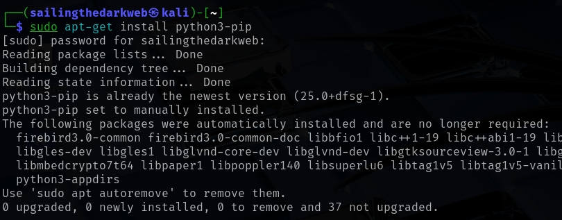
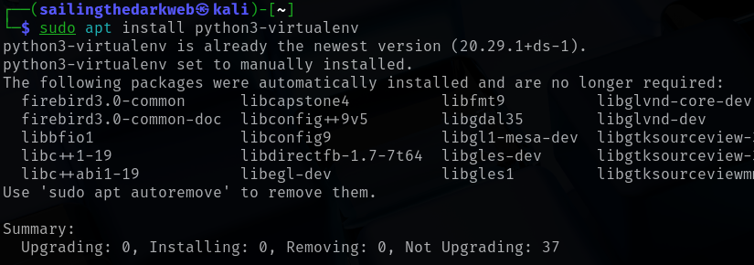
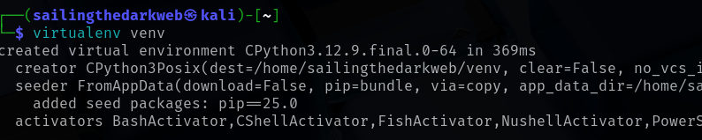
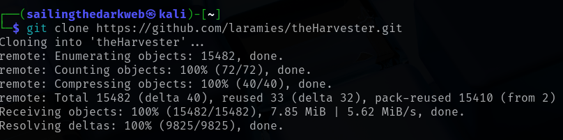
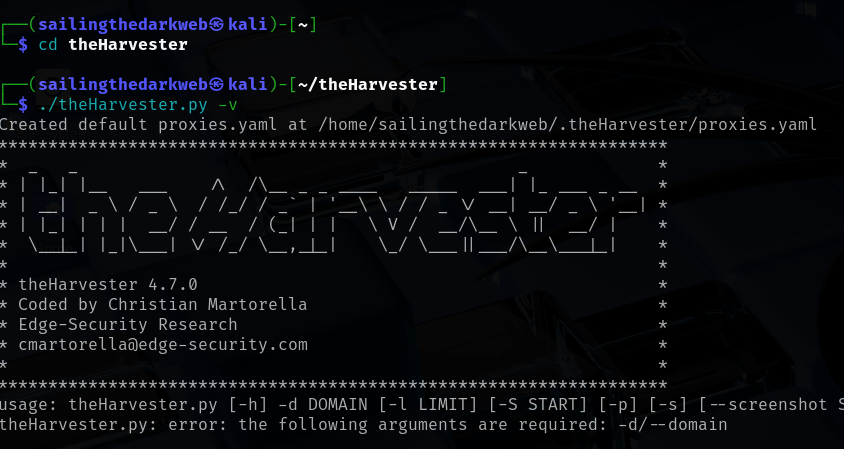
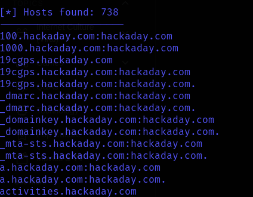
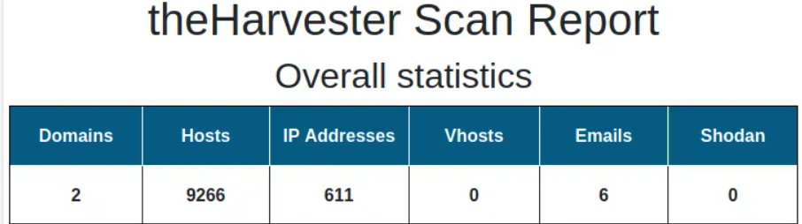

# Information Gathering Using theHarvester

In this lab, we will be attempting to gather information from a website using theHarvester

For this lab, we only require Kali Linux running on a virtual machine.

Check out this post on how to install Kali Linux: <a href="https://github.com/sai-kantamuneni/Kali-Linux-Tools/tree/main/1.%20Install%20Kali">Install Kali Linux</a>

You can also access this lab here: <a href="https://www.101labs.net/comptia-security/lab-8-information-gathering-using-theharvester/">101Labs</a>

## theHarvester
* TheHarvester is an open-source intelligence (OSINT) tool designed for cybersecurity professionals, ethical hackers, and penetration testers.
* It is primarily used during the reconnaissance phase of security assessments to gather publicly available information about a target organization or domain.
* TheHarvester collects data such as:-
  1. Subdomain names
  2. Email addresses
  3. IP addresses
  4. Hostnames

## Task 1 - Update theHarvester
* Let's download the latest version of TheHarvester.
* First let's install python, by typing:
`sudo apt-get install python3-pip`

* Then install Virtual Environment:
`sudo apt install python3-virtualenv`

* Now, we will create a new virtual environment by typing:
`virtualenv venv`

* Next, clone TheHarvester git repo by typing:
`git clone https://github.com/laramies/theHarvester.git`

* Navigate to the **theHarvester** directory by typing:
`cd theHarvester`

* Install the requirements to run theHarvester:
`sudo apt install python3-requirements`

* Close this terminal and open a new one.
* Now, we are ready to run theHarvester.

## Task 2 - Run theHarvester
* Navigate to the **theHarvester** directory.
* Start theHarvester by typing:
`./theHarvester.py -v`

* Let us launch an information gathering campaign on a target by typing:
`./theHarvester.py -d hackaday.com -b all`

* This will begin to search all search engines available to theHarvester for information related to hackaday.com

* As you can see, we found **67 IP addresses** related to hackaday.com

* We also found **738 subdomains** related to hackaday.com
* Let us display this information in an easier to read format by typing:
`./theHarvester.py -d hackaday.com -l 300 -b all -f report`

* This will save the information gathered in a html file called "**report.html**"

