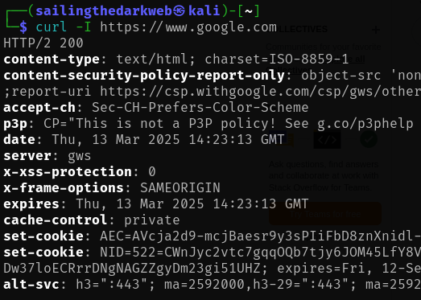

# cURL

In this lab, we will be attempting to manually gather information using **cURL**.

For this lab, we only require Kali Linux running on a virtual machine.

Check out this post on how to install Kali Linux: <a href="https://github.com/sai-kantamuneni/Kali-Linux-Tools/tree/main/1.%20Install%20Kali">Install Kali Linux</a>

You can also access this lab here: <a href="https://www.101labs.net/comptia-security/lab-10-using-curl/">101Labs</a>

## cURL
* cURL, which stands for “Client for URL,” is a versatile command-line tool and library for transferring data using various network protocols.
* It enables users to:-
  1. Transfer data to and from servers using URLs.
  2. Perform various HTTP methods such as GET, POST, and PUT.
  3. Handle authentication, cookies, and custom headers.

## Task 1 - Install cURL
* cURL can be installed on Linux by using the following command:
`sudo apt-get install curl`

* The basic syntax for using curl is the following:

## Task 2 - cURL options
* First, let us get the source code of a site by typing:
`curl https://www.google.com`

* Next let us save this output to a file:-
  1. We can use the “**-o**” flag to save with a preferred file name.
  2. We can use the “**-O**” flag to save with its original file name.

* cURL also allows you to download multiple files at once using the “-**O**” flag:
`curl -O https://arxiv.org/ftp/arxiv/papers/1610/1610.05971.pdf -O https://arxiv.org/pdf/2103.08624.pdf`

* If your connection drops while downloading a file, you can use resume the download with the “**-C-**” option.
`curl -C- -O https://arxiv.org/pdf/2103.08624.pdf`

* cURL can also be useful for downloading HTTP headers, which is useful when testing a site.
`curl -I https://example.com`

* This will display many pieces of information such as server info, content type and content encoding.

* You may discover that the target site may be designed to block cURL.
* In such cases, it is useful to emulate a browser, such as Firefox:
`curl -A "Mozilla/5.0 (X11; Linux x86_64; rv:60.0) Gecko/20100101 Firefox/60.0" https://ifconfig.me`

These are some of the options that cURL offers us to gather information.
