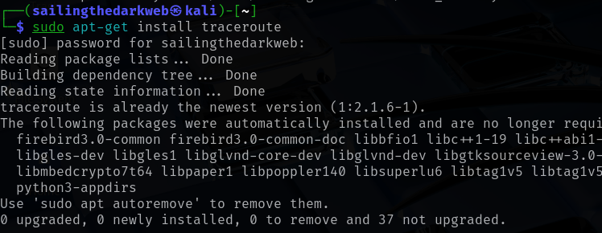
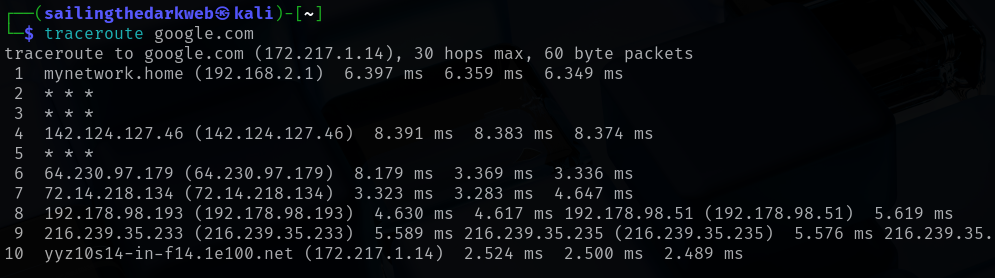

# Traceroute

In this lab, we will be attempting to trace the route to a host using **Traceroute**.

For this lab, we only require Kali Linux running on a virtual machine.

Check out this post on how to install Kali Linux: <a href="https://github.com/sai-kantamuneni/Kali-Linux-Tools/tree/main/1.%20Install%20Kali">Install Kali Linux</a>

You can also access this lab here: <a href="https://www.101labs.net/comptia-security/lab-11-using-traceroute-in-linux/">101Labs</a>

## Traceroute
* Traceroute is a network diagnostic tool used to track the pathway taken by data packets from a source to a destination on an IP network.
* It provides information about each hop along the route, including IP addresses, hostnames, and round-trip times.
* Uses:-
  1. Troubleshooting network connectivity issues.
  2. Identifying routing problems and unusual patterns.
  3. Locating points of failure in data transmission.
  4. Measuring response times between hops.

## Task 1 - Install Traceroute
* You can install Traceroute by typing:
`sudo apt-get install traceroute`

## Run Traceroute
* Let us run a traceroute to figure out the route to google.com
`traceroute google.com`

* Let us try to analyze what happened here:-
  1. The first line after the command shows the target's hostname and IP address (Google.com - 172.217.1.14)
  2. 30 hops means that traceroute will only route the first 30 routes between your system and target's system.
  3. The next IP address is our system's router (192.168.2.1)
  4. The 3 times display the round trip times for our packet to reach that point and return to our computer.
  5. The 10th hop is where we reach our target address.
